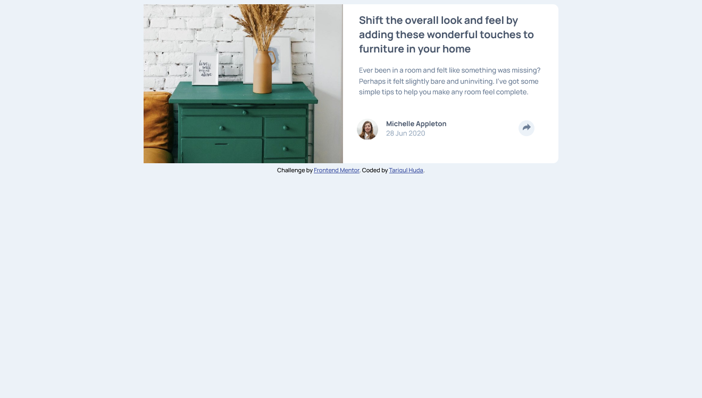
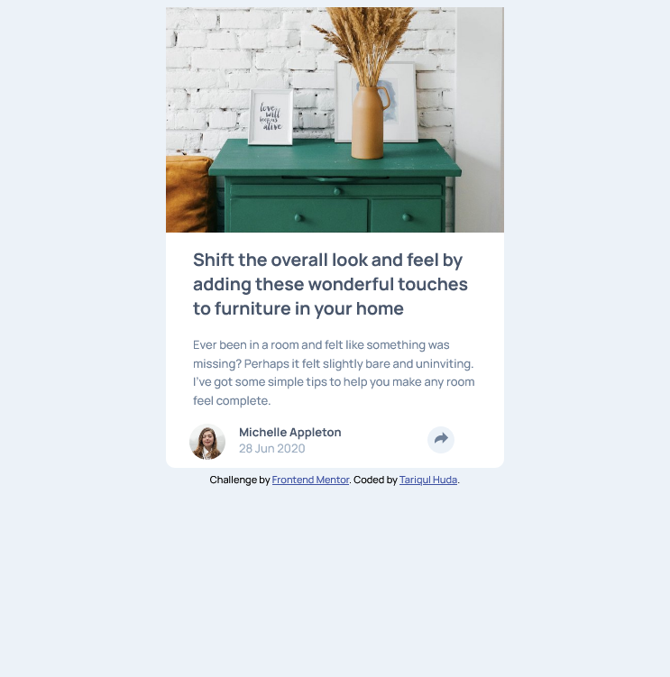

# Frontend Mentor - Article preview component solution

This is a solution to the [Article preview component challenge on Frontend Mentor](https://www.frontendmentor.io/challenges/article-preview-component-dYBN_pYFT). Frontend Mentor challenges help you improve your coding skills by building realistic projects. 

## Table of contents

- [Overview](#overview)
  - [The challenge](#the-challenge)
  - [Screenshot](#screenshot)
  - [Built with](#built-with)
  - [Continued development](#continued-development)
- [Author](#author)

## Overview
This page is not finished yet. I did what I can do at this moment. I will update this in near future

### The challenge

Users should be able to:

- View the optimal layout for the component depending on their device's screen size
- See the social media share links when they click the share icon

### Screenshot

### Links

- Solution URL: [Add solution URL here](https://your-solution-url.com)
- Live Site URL: [Live site](https://tariqul-huda.github.io/Article-preview-component/)

### Built with

- Semantic HTML5 markup
- CSS custom properties
- Flexbox

### Continued development

## Author
- Frontend Mentor - [@Tariqul Huda](https://www.frontendmentor.io/profile/Tariqul-huda)

